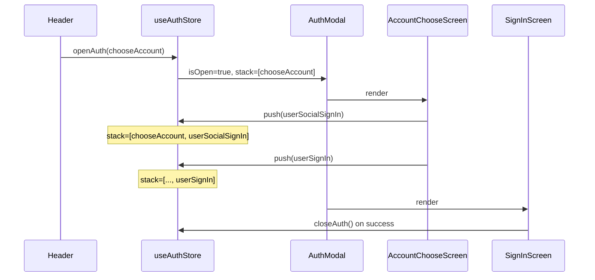
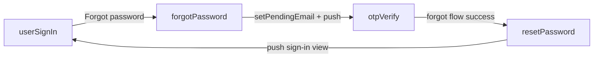

# Auth screen flow — Zustand + screen stack

Complete reference for how auth modal **screens** in `src/features/auth/screens/` are selected, switched, and closed. Screens are **not** App Router pages; they render inside `AuthModal` on the current pathname.

**No URL query params** are used for auth modal state. Navigation is driven by `useAuthStore` (`screenStack`) with transient data persisted in `sessionStorage` (`auth_transient`).

**Related:** [README.md](./README.md) · [authViews.ts](../../authViews.ts) · [hooks/README.md](./hooks/README.md) · [store/auth.store.md](./store/auth.store.md) · [application.md](../../../application.md)

---

## Table of contents

1. [Overview](#overview)
2. [Where it starts](#where-it-starts)
3. [Core mechanism: store → screen](#core-mechanism-store--screen)
4. [Modal state and sessionStorage](#modal-state-and-sessionstorage)
5. [Screen map](#screen-map)
6. [Navigation API](#navigation-api)
7. [Who triggers screen changes](#who-triggers-screen-changes)
8. [Closing the modal](#closing-the-modal)
9. [Flow diagrams](#flow-diagrams)
10. [Screen-by-screen transitions](#screen-by-screen-transitions)
11. [Back button behavior](#back-button-behavior)
12. [Refresh mid-flow](#refresh-mid-flow)
13. [Architecture (hooks + screens)](#architecture-hooks--screens)

---

## Overview

| Concept | Detail |
| --- | --- |
| **Trigger** | `useAuthStore.getState().openAuth(AUTH_VIEW.chooseAccount)` from headers, CTAs, etc. |
| **Orchestrator** | `AuthModal` (`src/features/auth/components/AuthModal.tsx`) |
| **View constants** | `AUTH_VIEW` in `authViews.ts` (stack identifiers only) |
| **Navigation** | `push(screen)` forward, `pop()` back, `openAuth(screen)` fresh stack |
| **Persistence** | `sessionStorage` key `auth_transient` via `authModalStorage.ts` |
| **Screens** | UI-only; logic in matching `use*Screen` hooks under `hooks/` |

The underlying page (property list, dashboard, etc.) **does not change**. Only Zustand modal state changes, which causes `AuthModal` to mount a different screen component.

---

## Where it starts

### Layout mounts the modal

`PublicLayout` and `LandingLayout` render `AuthModal` once inside `Suspense`:

- `src/layouts/public-layout/index.tsx`
- `src/layouts/landing-layout/index.tsx`

### Header opens auth

Headers call the store directly (no router query):

```tsx
useAuthStore.getState().openAuth(AUTH_VIEW.chooseAccount);
```

Used in `PublicHeader`, `DesktopActions`, `LandingHeader`, `LandingDesktopActions`.

---

## Core mechanism: store → screen

### Step 1 — `AuthModal` reads store

```tsx
const isOpen = useAuthStore((state) => state.isOpen);
const screenStack = useAuthStore((state) => state.screenStack);
const activeScreen = screenStack[screenStack.length - 1] ?? null;
```

| State | Meaning |
| --- | --- |
| `isOpen` | Modal visible |
| `screenStack` | Ordered list of visited `AUTH_VIEW` values |
| `activeScreen` | Top of stack → component to render |

On mount, `AuthModal` re-hydrates from `sessionStorage` in a `useEffect` (after first paint) so SSR and client initial HTML both render closed — avoids hydration mismatch.

### Step 2 — `renderAuthView` maps string → component

`switch (activeScreen)` returns the matching screen component (see [Screen map](#screen-map)).

### Step 3 — Screen hooks navigate via store

```tsx
const push = useAuthStore((state) => state.push);
const pop = useAuthStore((state) => state.pop);
const closeAuth = useAuthStore((state) => state.closeAuth);

push(AUTH_VIEW.forgotPassword); // forward
pop();                           // back
closeAuth();                     // success / dismiss
```

---

## Modal state and sessionStorage

**Module:** `src/features/auth/store/authModalStorage.ts`  
**Key:** `auth_transient` (single JSON object)

| Field | Purpose |
| --- | --- |
| `isOpen`, `screenStack` | Modal visibility and navigation history |
| `agentPortal` | Agent badge/behaviour on agency sign-in (replaces `portal=agent` URL param) |
| `otpFlow` | `signin` \| `forgot` \| `signup` — OTP context |
| `pendingEmail`, `pendingPhone`, `pendingPhoneCountry` | OTP / forgot-password contact |
| `otpSession`, `otpCode` | OTP session handoff (never in URL) |
| `pendingSignUp`, `pendingAgencySignUp` | Pre-submit registration form data for confirm step |

### Hygiene rules

- `writeAuthModalSession` is called **only** inside store setters (`auth.store.ts`).
- `clearAuthModalSession` is called **only** inside `closeAuth()`.
- Never store passwords, tokens, or full user objects in sessionStorage.
- `openAuth(screen)` starts a **fresh** stack and clears prior session data.

---

## Screen map

| `AUTH_VIEW` constant | Screen component |
| --- | --- |
| `chooseAccount` | `AccountChooseScreen` |
| `userSignIn` / `ownerSignIn` | `SignInScreen` (`type` prop) |
| `userSocialSignIn` / `ownerSocialSignIn` | `SocialSignInScreen` |
| `userSignUp` / `ownerSignUp` | `UserRegistrationScreen` |
| `userSocialSignUp` / `ownerSocialSignUp` | `SocialRegistrationScreen` |
| `agencySignIn` | `AgencySignInScreen` |
| `agencySignUp` | `AgencyRegistrationScreen` |
| `agencyEmailSignIn` | `AgencyEmailSignInScreen` |
| `forgotPassword` | `ForgotPasswordScreen` |
| `resetPassword` | `ResetPasswordScreen` |
| `signInOtp` | `SignInWithOTPScreen` |
| `otpVerify` | `OTPVerificationScreen` |
| `confirmSignUp` | `ConfirmSignUpScreen` |

---

## Navigation API

| Action | Store method | Stack effect |
| --- | --- | --- |
| Open modal | `openAuth(screen)` | `[screen]` — resets session |
| Navigate | `navigate(screen)` | **root** / **sibling** / **child** — see `auth.navigation.ts` |
| Back | `pop()` | Removes last entry if length > 1 |
| Close | `closeAuth()` | Clears stack + sessionStorage |

`navigate()` uses `SCREEN_NAV_TYPE` in `auth.navigation.ts`:

| Type | Behavior |
| --- | --- |
| `root` | Wipe stack → `[screen]` |
| `sibling` | Replace top (toggle sign-in/sign-up, user/owner); append if top is `choose-account` |
| `child` | Push forward, or slice back if screen already in stack (no duplicates) |

Use `navigate(AUTH_VIEW.*)` in hooks and forms — not raw stack mutation.

Helper: `useAuthModalNavigation()` returns `{ canGoBack, onBack }` from stack length.

- `getAuthContextFromStack(screenStack)` — infer user/owner/agency from stack
- `isAgencyContextFromStack(screenStack)` — agency/agent flows

---

## Who triggers screen changes

| Source | Typical navigation |
| --- | --- |
| Header “Sign in” | `openAuth(chooseAccount)` |
| `useAccountChooseScreen` | `push(resolveAccountTypeAuthView(type, mode))` |
| `SignInForm` | `push(forgotPassword)`, `push(signInOtp)` |
| `useSignInScreen` | `closeAuth()` on password sign-in success |
| `useForgotPasswordScreen` | `setPendingEmail`, `setOtpFlow('forgot')`, `push(otpVerify)` |
| `useSignInWithOTPScreen` | `setOtpSession`, `push(otpVerify)` |
| `useOTPVerificationScreen` | sign-in success → `closeAuth()`; forgot → `push(resetPassword)` |
| `useResetPasswordScreen` | reads `otpCode` from store; success → `push(signInView)` |
| `useUserRegistrationScreen` | `setPendingSignUp`, `push(confirmSignUp)` |
| `useAgencyRegistrationScreen` | `setPendingAgencySignUp`, `push(confirmSignUp)` |
| `useConfirmSignUpScreen` | success → `push(signInView)`; back → clear pending + `pop()` |
| Social / agency hooks | `push(...)` for footer links and alternate entry paths |

---

## Closing the modal

| Event | Handler |
| --- | --- |
| Modal backdrop / escape | `closeAuth()` via `Modal` `onClose` |
| Successful sign-in | `closeAuth()` in screen hook / mutation callback |
| Logout | `clearAuth()` — clears **session tokens**, not modal state (modal usually closed) |

`closeAuth()` clears `sessionStorage` and resets all modal transient fields.

---

## Flow diagrams

### Choose account → user email sign-in



### Forgot password → OTP → reset



---

## Screen-by-screen transitions

### Sign-in (`useSignInScreen`)

- Forgot password → `push(AUTH_VIEW.forgotPassword)`
- Sign in with OTP → `push(AUTH_VIEW.signInOtp)`
- Success → `closeAuth()`

### Forgot password (`useForgotPasswordScreen`)

- Submit → `setPendingEmail(email)`, `setOtpFlow('forgot')`, `push(AUTH_VIEW.otpVerify)`

### OTP verify (`useOTPVerificationScreen`)

- Reads `pendingEmail`, `otpSession`, `otpFlow` from store
- Sign-in OTP success → `closeAuth()`
- Forgot OTP success → `push(AUTH_VIEW.resetPassword)`

### Reset password (`useResetPasswordScreen`)

- Reads `otpCode` from store (set during OTP verify)
- Success → `push(resolveSignInViewAfterPasswordReset(...))`

### Registration (`useUserRegistrationScreen` / `useAgencyRegistrationScreen`)

- Submit → `setPendingSignUp` or `setPendingAgencySignUp`, `push(AUTH_VIEW.confirmSignUp)`

### Confirm sign-up (`useConfirmSignUpScreen`)

- Reads pending data from store
- Back → `clearPendingSignUp()`, `clearPendingAgencySignUp()`, `pop()`
- Verify success → `push(signInViewFromSignUp)`

### Agency / agent portal

- Choosing **agent** account type → `setAgentPortal(true)` + `push(agencySignIn)`
- `useAuthPortal()` exposes `"agent" | null` for UI badge

---

## Back button behavior

- Each screen hook uses `useAuthModalNavigation()` → `showBack: canGoBack`, `onBack: pop`.
- `AuthModalHeader` shows back only when `onBack` is defined.
- **Exception:** `ConfirmSignUpScreen` clears `pendingSignUp` / `pendingAgencySignUp` before `pop()`.
- No `from` query param — history is the stack itself.

---

## Refresh mid-flow

1. User is on e.g. forgot-password with email in store → persisted to `sessionStorage`.
2. Page refresh: store starts closed; `AuthModal` `useEffect` calls `readAuthModalSession()` and `setState` if `isOpen`.
3. Modal reopens at the same stack depth with email/OTP session restored.
4. Closing modal clears storage.

---

## Architecture (hooks + screens)

```
Header / CTA
    └── openAuth(AUTH_VIEW.*)
            └── useAuthStore (Zustand + sessionStorage)
                    └── AuthModal
                            └── renderAuthView(activeScreen)
                                    └── *Screen.tsx (UI only)
                                            └── use*Screen.ts (push/pop/closeAuth)
                                                    └── mutations → services → API
```

**Components** render; **hooks** own navigation, transient data, and mutation callbacks. See [hooks/README.md](./hooks/README.md) and [screens/README.md](./screens/README.md).
